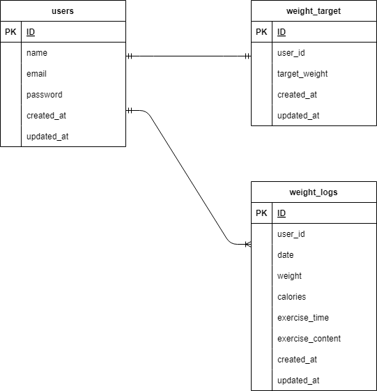

## アプリケーション名
確認テスト：Pigly  

## 環境構築

・リポジトリの設定  
コマンドラインにてgit clone git@github.com:yuusukejinba/jinba-last.git  

・Docker の設定  
1.docker-compose up -d --build  
2.docker-compose exec php bash:PHPコンテナ内にログイン  
3.composer install:コンポーズインストール  
4.php artisan key:generate  
5.php artisan migrate  
6.php artisan db:seed  
7.http://localhostにアクセスして  
"The stream or file could not be opened"というエラーが発生した場合は  
ファイルの権限を変更して対応お願いします  

・.env ファイルの作成  
1.cp .env.example .env: .env.exampleファイルをコピー  
2.DB_HOST=127.0.0.1→DB_HOST=mysql  
3.DB_DATABASE=→DB_DATABASE=laravel_db  
4.DB_USERNAME=→DB_USERNAME=laravel_user  
5.DB_PASSWORD=→DB_PASSWORD=laravel_passに変更  

table作成  
・userテーブル  
・weight_logsテーブル  
・weight_targetテーブル  

## 使用技術（実行環境）  

・PHP8.3.0  
・Laravel8.83.27  
・MySQL8.0.26  

## ER図
"		
        
## URL  

開発環境：  
会員登録：http://localhost/register/step1  
体重登録：http://localhost/register/step2  
トップページ(管理画面)：http://localhost/weight_logs  
ログイン画面：http://localhost/login  
phpMyAdmin:：http://localhost:8080/  

